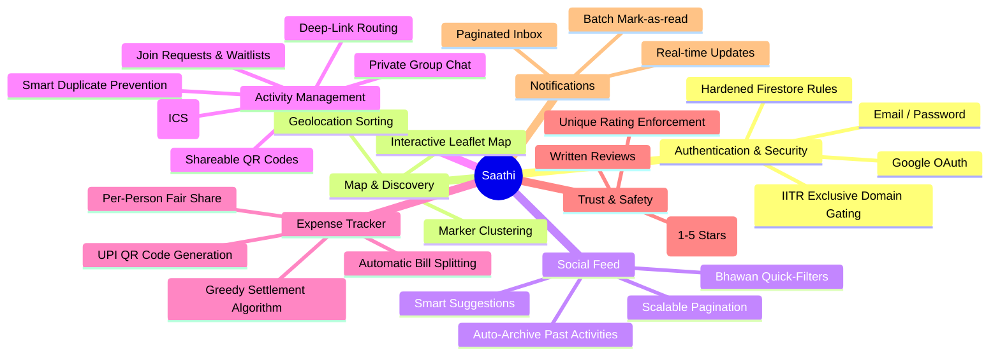

# Saathi — Find your people. On campus.

Saathi is an exclusive social coordination platform built for IIT Roorkee students. Whether you are looking for a travel companion to the railway station, a study group for end-sems, or friends to play badminton with, Saathi helps you find your circle and coordinate effortlessly.

## 🧠 Feature Mindmap



## ✨ Detailed Features Breakdown

### 🔐 1. Authentication & Security
- **IITR Exclusive Gating**: Strictly gated platform. Only users with `@*.iitr.ac.in` email addresses are allowed to register or login. Checked both on the client and enforced at the Firestore security rules level.
- **Security Hardening**: Firestore rules prevent race conditions (like overbooking spots), enforce data validation, and restrict chat/expense access strictly to approved members.

### 🗺️ 2. Map View & Discovery
- **Interactive Map View**: Uses Leaflet and React-Leaflet to visualize activities geographically across the IITR campus.
- **Marker Clustering**: Groups nearby activities into clusters to prevent map clutter when zoomed out.
- **Geolocation & Distance Sorting**: Optionally sorts activities based on the user's physical distance from the meeting point.

### 💸 3. Integrated Expense Tracker
- **Automatic Bill Splitting**: Add cab fares, meals, or any shared cost. The system automatically divides the total cost among approved members (fair share).
- **Greedy Settlement Algorithm**: Calculates exactly who owes whom using an optimized algorithm to minimize the number of transactions.
- **UPI QR Code Generation**: Generates standard UPI QR codes (`upi://pay`) directly within the app so debtors can scan and pay creditors instantly.

### 👥 4. Group Coordination & Waitlists
- **Waitlists & Host Approvals**: When a user wants to join an activity, they enter a waitlist. The host receives a notification and can approve or decline the request.
- **Private Group Chats**: Once a member is approved, they gain access to a real-time, private chat room restricted exclusively to the activity's roster.
- **Smart Duplicate Prevention**: Before publishing a new activity, the platform checks for similar active circles (same time + destination) and suggests joining them to encourage pooling over fragmentation.

### 📅 5. Activity Management & Sharing
- **Shareable QR Codes & Deep Links**: Every activity gets an auto-generated QR code and a deep-link URL (e.g., `?activity=ID`), making it trivial to share on WhatsApp or posters.
- **Calendar Export**: A one-click export generates an `.ics` file to add the activity to Google Calendar or Apple Calendar.
- **Auto-Archive**: Activities whose dates have passed are automatically archived to keep the active feed clean.

### 📜 6. Scalable Real-time Feed
- **Infinite Scrolling Pagination**: Uses cursor-based Firestore pagination (loading 15 activities at a time) for a smooth and highly scalable feed.
- **Bhawan Quick-Filters**: Instantly filter the feed to only show activities originating from your specific Bhawan/Hostel.
- **Smart Suggestions**: Strips away irrelevant noise by suggesting activities that match your department, year, or interests.

### 🔔 7. Notifications & Trust
- **Robust Notifications Center**: Tracks chat messages, waitlist requests, and host decisions. Supports pagination (limit 20 + load older) and batch mark-as-read.
- **Peer Rating System**: After an activity, members can leave a 1-5 star rating and a written review for the host.
- **Unique Rating Enforcement**: Deterministic document IDs ensure users can only rate a specific activity once.

## 🛠️ Tech Stack

- **Frontend**: React 19, Vite, TypeScript
- **Styling & UI**: Tailwind CSS v4, Lucide Icons, Framer Motion
- **Maps**: Leaflet, React-Leaflet, MarkerCluster
- **Utilities**: React-QR-Code, Sonner (Toasts)
- **Backend / Database**: Firebase (Auth, Firestore)
- **Deployment Ready**: Configured for Vercel and Netlify (SPA routing included)

## 🚀 Local Setup

1. **Install Dependencies**
   ```bash
   npm install
   ```

2. **Configure Environment Variables**
   Copy `.env.example` to `.env` and fill in your Firebase configuration keys:
   ```bash
   cp .env.example .env
   ```

3. **Start the Development Server**
   ```bash
   npm run dev
   ```
   The app will be running at `http://localhost:5173`.

## 🌐 Deployment (Vercel / Netlify)

This project is perfectly optimized for free-tier deployments on **Vercel** or **Netlify**. It uses a purely static SPA architecture with no backend server required.

### Steps to Deploy:
1. Push this repository to GitHub.
2. Go to Vercel or Netlify and import the repository.
3. The platform will automatically detect **Vite** as the framework.
4. **Important**: Add all the `VITE_FIREBASE_*` environment variables (found in `.env.example`) to your Vercel/Netlify project settings before deploying.
5. In your [Firebase Console](https://console.firebase.google.com/), go to **Authentication > Settings > Authorized Domains** and add your new Vercel/Netlify domain (e.g., `saathi.vercel.app`) so Google Login works.
6. Deploy!

*Note: Custom routing rules for SPAs are already included in the `vercel.json` and `netlify.toml` files in this repository.*
